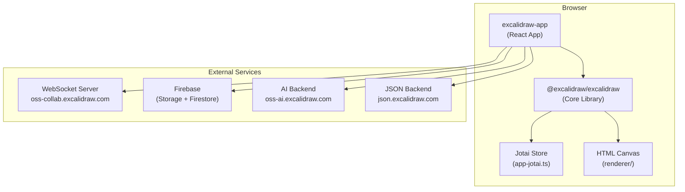
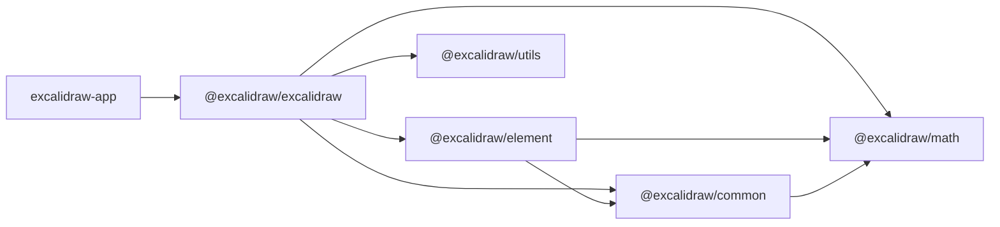

# Technical Context

> Deep dives: [architecture.md](../technical/architecture.md) · [infrastructure.md](../technical/infrastructure.md) · [dev-setup.md](../technical/dev-setup.md) · [dependency-map.md](../reference/dependency-map.md) · [api-schema.md](../reference/api-schema.md)

## Tech Stack

### Runtime & Build

| Layer | Technology | Version |
|-------|-----------|---------|
| Language | TypeScript (strict) | 5.9.3 |
| UI Framework | React | 19.0.0 |
| Build Tool | Vite | 5.0.12 |
| Package Manager | Yarn Workspaces | 1.22.22 |
| Node Requirement | Node.js | ≥ 18.0.0 |

### Core Libraries

| Library | Purpose |
|---------|---------|
| Rough.js 4.6.4 | Hand-drawn rendering effect on canvas |
| Perfect-freehand 1.2.0 | Smooth freehand strokes |
| Jotai 2.11.0 | Atom-based global state management |
| Socket.io-client 4.7.2 | Real-time WebSocket collaboration |
| Firebase 11.3.1 | Auth, Firestore, Cloud Storage |
| Pako 2.0.3 | Compression for scene data |
| i18next-browser-languagedetector 6.1.4 | Auto language detection |
| CodeMirror 6 | Code editor for AI/TTD dialog |
| Mermaid | Diagram conversion (mermaid-to-excalidraw) |
| Radix-UI 1.4.3 | Accessible UI primitives |
| Sentry 9.0.1 | Error monitoring |

### Testing

| Tool | Role |
|------|------|
| Vitest 3.0.6 | Unit test runner |
| @testing-library/react 16.2.0 | DOM testing utilities |
| vitest-canvas-mock | Mock HTMLCanvasElement |
| jsdom | Browser DOM simulation |
| @vitest/coverage-v8 | Code coverage |

### Linting & Formatting

- ESLint with `@excalidraw/eslint-config`
- Prettier with `@excalidraw/prettier-config`
- Husky + lint-staged for pre-commit hooks

## Architecture Overview



## Package Dependency Graph



## External Services

| Service | URL | Purpose |
|---------|-----|---------|
| Collab WebSocket | `oss-collab.excalidraw.com` | Real-time session sync |
| JSON Storage | `json.excalidraw.com/api/v2/` | Share link scene storage |
| AI Backend | `oss-ai.excalidraw.com` | Text-to-diagram generation |
| Firebase | `excalidraw-room-persistence` (prod) | Auth, files, libraries |
| Library CDN | `us-central1-excalidraw-room-persistence.cloudfunctions.net` | Library management |

## Infrastructure

- **Hosting:** Vercel (production) or Nginx via Docker
- **Docker:** Multi-stage (node:18 → nginx:1.27-alpine)
- **PWA:** Service worker with Workbox caching strategy
- **CI/CD:** GitHub Actions (test, lint, size-limit, Docker publish, auto-release)

## Environment Configuration

| Variable | Dev | Prod |
|----------|-----|------|
| `VITE_APP_WS_SERVER_URL` | `http://localhost:3002` | `https://oss-collab.excalidraw.com` |
| `VITE_APP_AI_BACKEND` | `http://localhost:3016` | `https://oss-ai.excalidraw.com` |
| Dev port | 3001 | — |

## Core Commands

| Command | Purpose |
|---------|---------|
| `yarn start` | Dev server at `http://localhost:3001` |
| `yarn build:app` | Production build → `excalidraw-app/build/` |
| `yarn build:packages` | Build all publishable packages |
| `yarn test:app` | Run Vitest unit tests |
| `yarn test:coverage` | Generate coverage report |
| `yarn test:all` | ESLint + Prettier + Vitest |
| `yarn fix:code` | Auto-fix ESLint issues |
| `yarn fix:other` | Auto-format with Prettier |

## Local Storage Keys

| Key | Content |
|-----|---------|
| `excalidraw` | Serialized drawing elements |
| `excalidraw-state` | Application state (view, tool, etc.) |
| `excalidraw-collab` | Collaboration settings |
| `excalidraw-theme` | User theme preference |
| `excalidraw-debug` | Debug overlay settings |
| `version-dataState` | Version tracking for data state |
| `version-files` | Version tracking for files |

## Browser Storage Strategy

```text
Elements ─────► localStorage (excalidraw)
Libraries ────► IndexedDB
Files ────────► Firebase Storage (with local cache)
Share links ──► json.excalidraw.com (encrypted)
```
